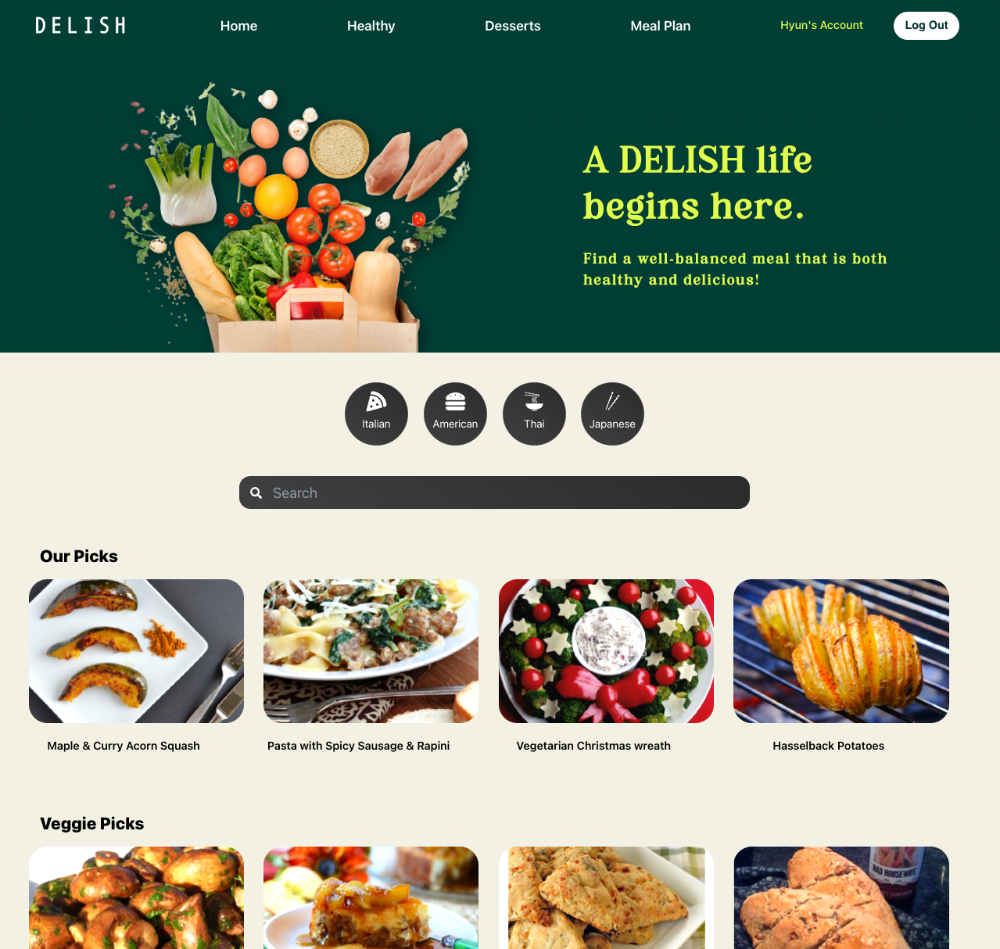
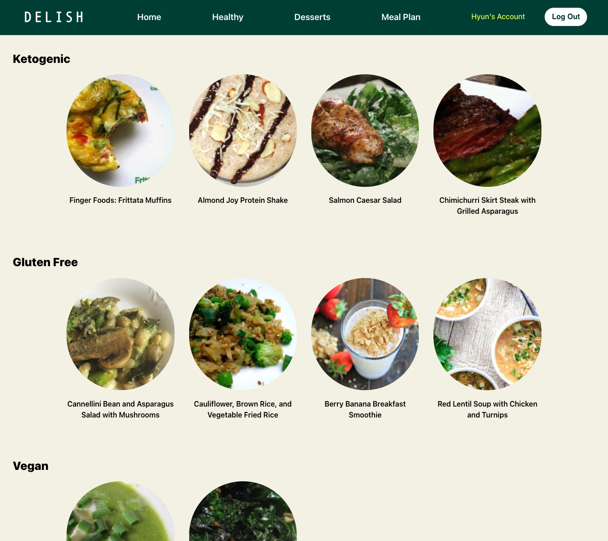
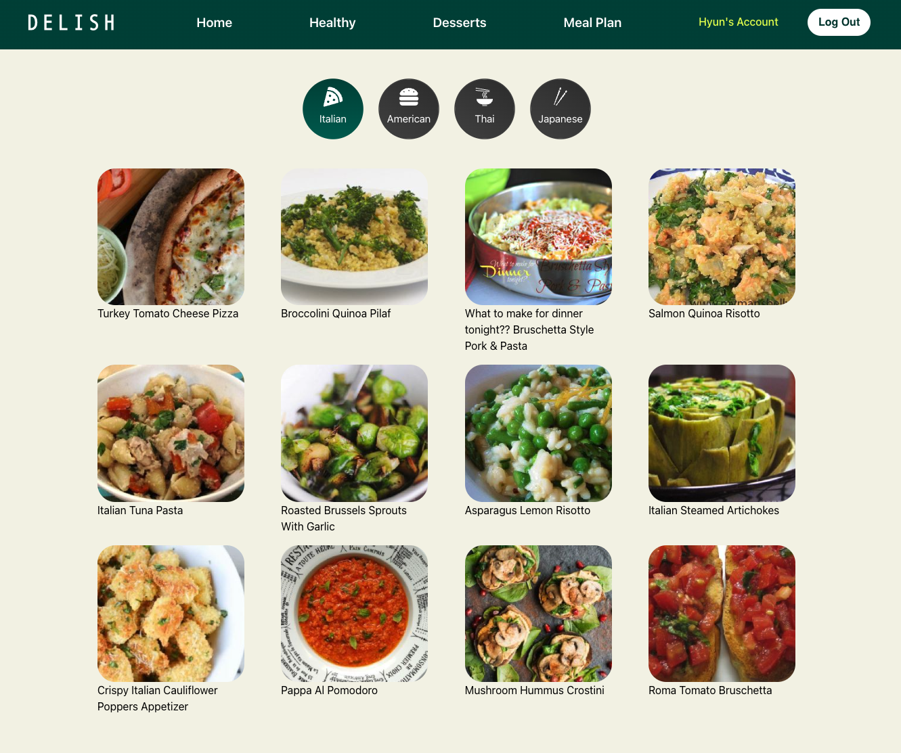
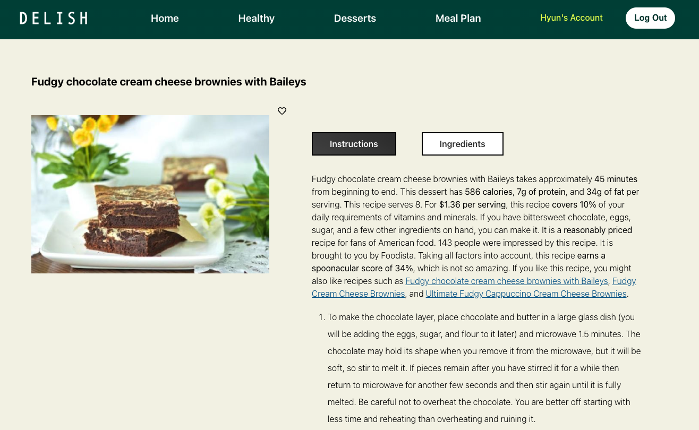
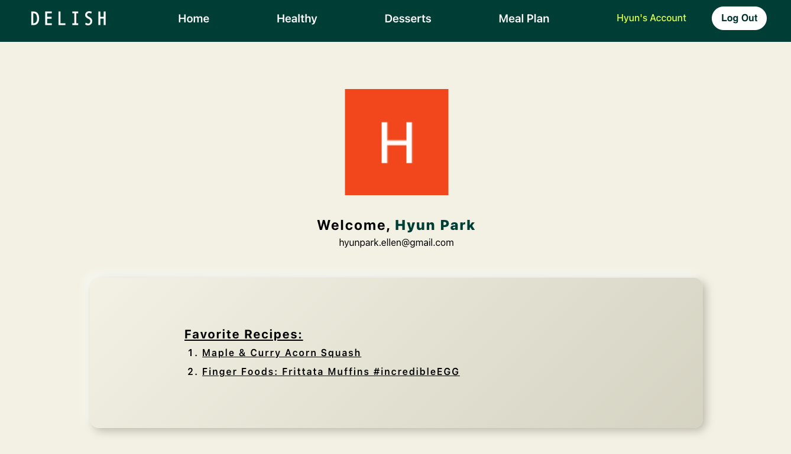

## DELISH - Recipe & Meal Planning

- Delish is a web-based application designed to help professional and everyday cooks discover new recipes from around the world. 
- With a user-friendly interface, Delish allows users to tailor their recipe searches based on specific ingredients, cuisines, dietary needs. 
- Delish also helps with meal planning - by inputting their daily caloric intake, users receive three recipe suggestions that align with their dietary goals, accompanied by comprehensive nutritional insights.

## Preview 

### Home page 

### Recipes by category
 

### Recipes by cuisine

### Detailed recipes

### Meal planning 

### Favorites 

## Technologies Used

- React
- CSS
- Auth0
- Spoonacular(3rd Party API)
- Splide
- Netlify

## Getting Started

[Click to see the app!](https://delish-recipes-and-mealplans.netlify.app/)

## License

Distributed under the MIT License. See `LICENSE` for more information.

## Next Steps 

- Integrate backend database
- Add user-centric features such as custom recipe uploads and share/save recipes functionalities
- Enhance meal planning options to include dietary restrictions and timeline (daily, weekly, monthly) options 
- Implement additional icebox features such as groceries list generator and advanced nutritional data visualization 

(<a href="#readme-top">back to top</a>)

