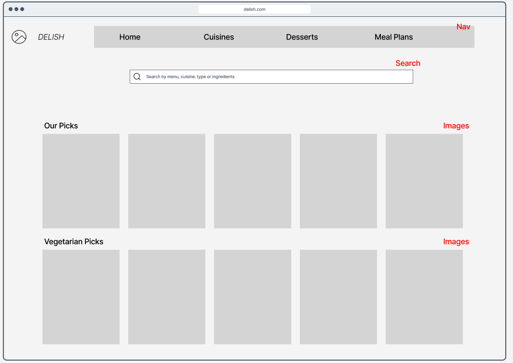
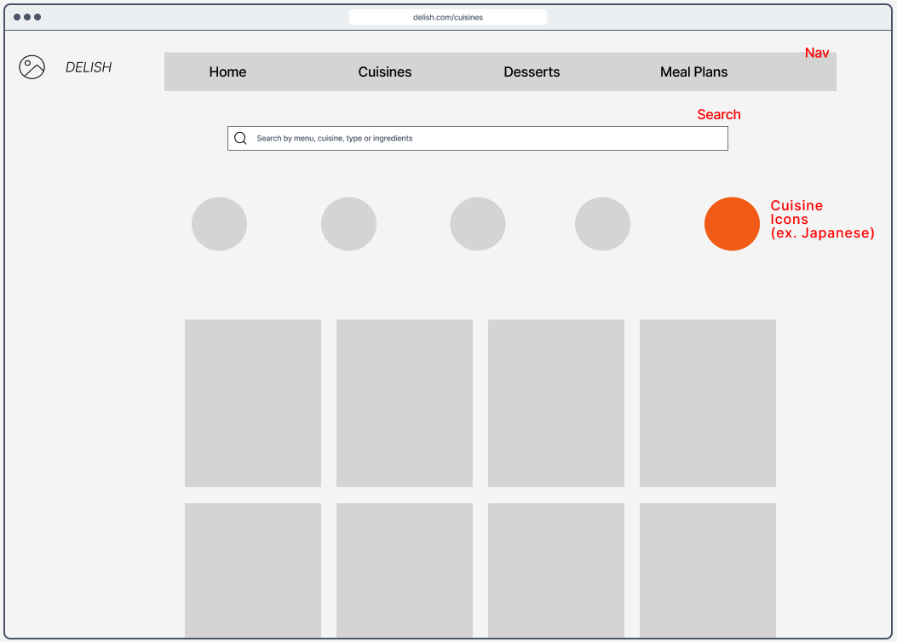
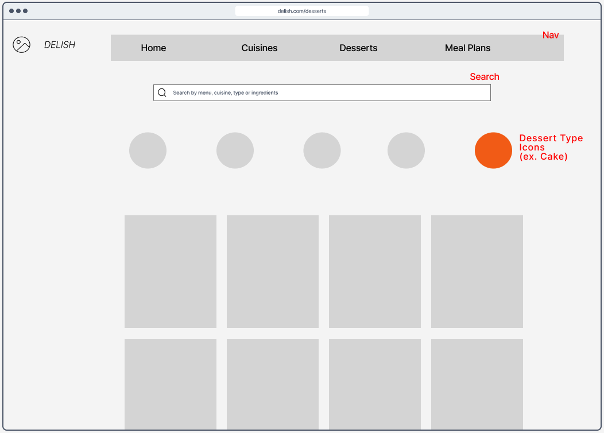
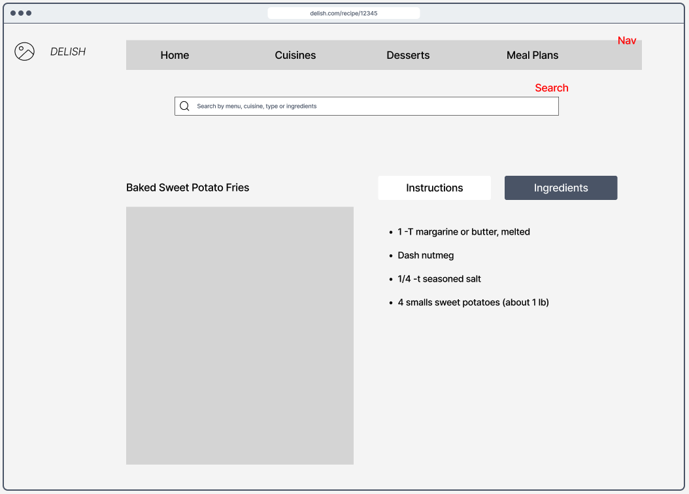
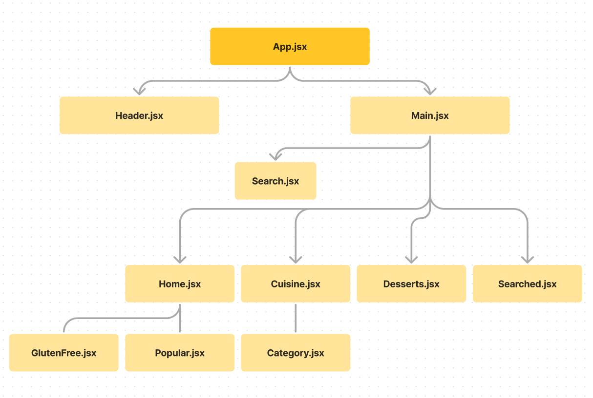

# Delish : Project 3 Planning

### Project Summary

- Delish is a web-based application designed to help professional and everyday cooks discover new recipes from around the world. With a sleek, user-friendly interface, users can search for dishes based on ingredients, cuisines, or dietary preferences, making meal planning and exploration a breeze.

- Trello board - [link](https://trello.com/b/2DJ8i4C5/react-pjt-recipe-finder)

- Wireframes (figma) - [link](https://www.figma.com/file/EbCfiWMkFoqT4bdJaBwf3H/Delish-Wireframe?type=design&node-id=0-1&mode=design&t=iIh001G7sMSX6Aa0-0)

### Wireframe Images

Home Page:


Cuisines Page: 


Desserts Page: 


Recipe(Details) Page: 


### Component Tree (WIP)



### User Stories 

 | No. | Description | Priority |
 | --- | --- | --- |
 | 1 | Search recipe by menu name | MVP |
 | 2 | Search recipe by cuisine | MVP |
 | 3 | Search recipe by ingredients | MVP |
 | 4 | Search recipe by type (ex.gluten-free) | MVP |
 | 5 | View popular recipes by category (ex.vegetarian) on home page | MVP |
 | 6 | Navigate through popular cuisines on cuisines page | MVP |
 | 7 | Navigate through popular desserts on desserts page | MVP |
 | 8 | Click & view each recipe on details page | MVP |
 | 9 | View selected recipe's cooking instruction and ingredients | MVP |
 | 10 | Log-in using google account | Icebox |
 | 11 | Save 'favorite' recipes | Icebox |
 | 12 | Generate meal-plans | Icebox |
 
### API Reference

- App uses Spoonacular API to generate and fetch information

🔽 Example Request and Response
```
{
    "offset": 0,
    "number": 2,
    "results": [
        {
            "id": 716429,
            "title": "Pasta with Garlic, Scallions, Cauliflower & Breadcrumbs",
            "image": "https://spoonacular.com/recipeImages/716429-312x231.jpg",
            "imageType": "jpg",
        },
        {
            "id": 715538,
            "title": "What to make for dinner tonight?? Bruschetta Style Pork & Pasta",
            "image": "https://spoonacular.com/recipeImages/715538-312x231.jpg",
            "imageType": "jpg",
        }
    ],
    "totalResults": 86
}
```


